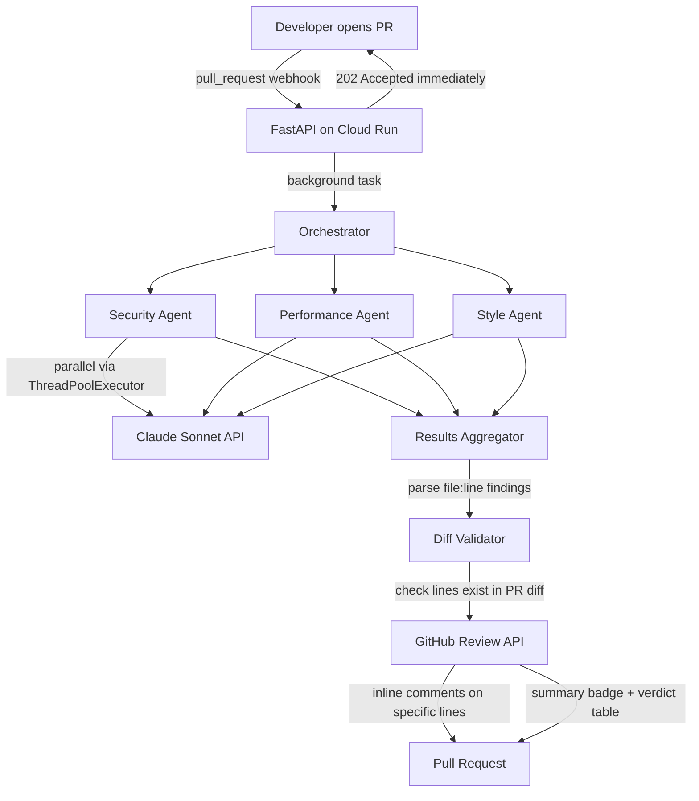

# AI Code Review Pipeline

An autonomous multi-agent system that reviews GitHub Pull Requests in real time — posting inline comments on specific lines of code, just like CodeRabbit or Sourcery, but built from scratch.


---

## Demo

> Open a pull request → AI reviews it in ~45 seconds → inline comments appear on the exact lines with issues


*(Replace with a screen recording of a live PR review)*

---

## Architecture



---

## Features

- **3 parallel AI agents** — Security, Performance, and Style reviewers run concurrently, not sequentially
- **Inline line-level comments** — findings are pinned to the exact line of code using the GitHub Review API
- **Diff-aware** — only comments on lines that exist in the PR diff, preventing GitHub API errors
- **Non-blocking webhook** — returns `202 Accepted` instantly so GitHub never times out; review runs in the background
- **HMAC signature verification** — validates every webhook payload is genuinely from GitHub
- **Verdict system** — each agent returns `pass / warn / block`; one block escalates the overall review
- **Graceful fallback** — findings without a specific line location appear in the review summary body

---

## Tech Stack

| Layer | Technology |
|---|---|
| AI Agents | CrewAI + Claude Sonnet (Anthropic) |
| Webhook Server | FastAPI + Uvicorn |
| GitHub Integration | PyGithub + GitHub REST API v3 |
| Deployment | GCP Cloud Run + Docker |
| HTTP Client | httpx |
| Config | pydantic-settings |

---

## How It Works

### 1. Webhook receives the PR event
GitHub sends a `pull_request` event (opened / synchronized / reopened) to the Cloud Run service. The handler verifies the HMAC-SHA256 signature and returns `202 Accepted` immediately — the review runs in a background thread.

### 2. Three agents run in parallel
Each agent is a dedicated CrewAI `Crew` with a Claude Sonnet LLM and two GitHub tools (`fetch_pr_diff`, `fetch_pr_metadata`). They run concurrently via `ThreadPoolExecutor`:

- **Security Agent** — checks for OWASP Top 10: injection, hardcoded secrets, broken auth, path traversal, SSRF
- **Performance Agent** — identifies N+1 queries, O(n²) algorithms, blocking I/O in async contexts, missing pagination
- **Style Agent** — flags bare excepts, unclear naming, duplicated logic, missing type hints, dead code

### 3. Findings are parsed and validated
Each agent outputs structured markdown with `File:` and `Line:` fields per finding. The orchestrator:
1. Parses findings into structured objects
2. Fetches the PR diff and extracts commentable line numbers
3. Routes findings with valid `file:line` as inline comments; others go into the review body

### 4. GitHub Review is posted
A single GitHub Review is submitted with all inline comments attached. The summary shows a verdict table with a color-coded badge.

---

## Project Structure

```
├── agents/
│   ├── security_agent.py     # OWASP / injection / secrets focus
│   ├── performance_agent.py  # N+1 / algorithm / async I/O focus
│   ├── style_agent.py        # naming / DRY / error handling focus
│   └── tools.py              # fetch_pr_diff, fetch_pr_metadata
├── orchestrator/
│   ├── crew.py               # ThreadPoolExecutor parallel runner
│   ├── parser.py             # extract file:line findings from agent output
│   ├── diff_utils.py         # parse PR diff for valid comment positions
│   └── github_review.py      # post GitHub Review with inline comments
├── webhook/
│   └── handler.py            # FastAPI, HMAC verification, background tasks
├── config/
│   └── settings.py           # pydantic-settings, .env-based
├── scripts/
│   ├── dev.sh                # start server + ngrok + register webhook
│   ├── setup_webhook.py      # register/update/delete GitHub webhook
│   └── deploy_cloud_run.sh   # build, push, deploy to GCP Cloud Run
├── tests/
│   └── test_orchestrator.py  # unit tests for synthesis logic
└── Dockerfile
```

---

## Setup

### Prerequisites
- Python 3.12
- [ngrok](https://ngrok.com) (local dev only)
- GCP account with billing enabled (production)

### Local Development

```bash
# 1. Clone and install
git clone https://github.com/HananProjects/ai-code-review-pipeline
cd ai-code-review-pipeline
python3.12 -m venv .venv && source .venv/bin/activate
pip install -r requirements.txt

# 2. Configure
cp .env.example .env
# Fill in ANTHROPIC_API_KEY, GITHUB_TOKEN, GITHUB_WEBHOOK_SECRET

# 3. Start server + tunnel + register webhook in one command
./scripts/dev.sh owner/your-repo
```

### Deploy to GCP Cloud Run

```bash
# Authenticate
gcloud auth login
gcloud config set project your-project-id

# Enable APIs
gcloud services enable run.googleapis.com cloudbuild.googleapis.com artifactregistry.googleapis.com

# Deploy (builds Docker image remotely, no local Docker needed)
gcloud run deploy ai-code-review \
    --source . \
    --region us-central1 \
    --allow-unauthenticated \
    --set-env-vars "ANTHROPIC_API_KEY=...,GITHUB_TOKEN=...,GITHUB_WEBHOOK_SECRET=..." \
    --timeout 300

# Register the permanent webhook URL
python scripts/setup_webhook.py \
    --repo owner/repo \
    --url https://YOUR-SERVICE-URL/webhook
```

### Environment Variables

| Variable | Description |
|---|---|
| `ANTHROPIC_API_KEY` | From [console.anthropic.com](https://console.anthropic.com) |
| `GITHUB_TOKEN` | Fine-grained PAT with **Pull requests: Read & Write** and **Webhooks: Read & Write** |
| `GITHUB_WEBHOOK_SECRET` | Random secret shared with GitHub webhook config |
| `CLAUDE_MODEL` | Default: `claude-sonnet-4-6` |

---

## Example Review Output

Each agent posts findings directly on the relevant lines:

**Security finding on line 15:**
> **[Security] SQL Injection via String Concatenation**
> - Severity: Critical
> - Description: User input is concatenated directly into the SQL query string, allowing an attacker to manipulate the query.
> - Remediation: Use parameterized queries — `cursor.execute("SELECT * FROM signs WHERE word = ?", (word,))`

**Review summary:**

| Agent | Verdict |
|---|---|
| Security | BLOCK |
| Performance | BLOCK |
| Style | WARN |

---

## License

MIT
